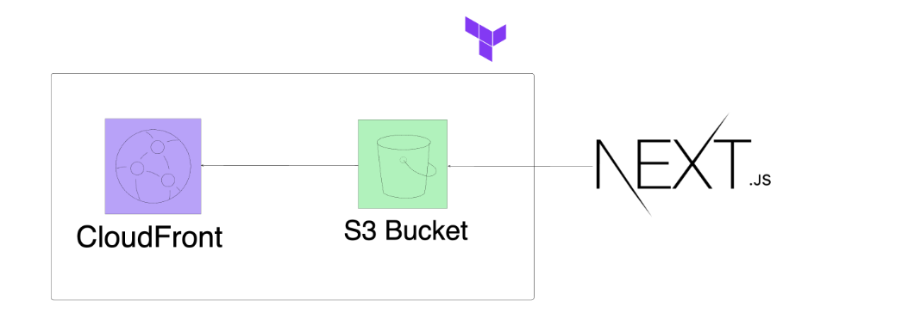

This is a starter template for [Learn Next.js](https://nextjs.org/learn).

Read me file 

# 🚀 Next.js Portfolio Deployment with AWS & Terraform

## Project Overview
This project deploys a Next.js portfolio website on AWS using Infrastructure as Code (IaC) with Terraform. The goal is to ensure the website is highly available, scalable, cost-effective, and fast-loading for a global audience.

### 🛠 Technologies Used: 
Frontend: Next.js (Static Site Export)

AWS Services: S3 (Static Hosting), CloudFront (CDN), IAM (Security)

IaC: Terraform

Version Control: GitHub

### 🌍 Key Features:
✅ Static Hosting: Deploys the exported Next.js site to an S3 bucket

✅ Global CDN: Uses CloudFront for fast content delivery

✅ IaC Automation: Configures AWS resources using Terraform

✅ Security Best Practices: IAM roles & bucket policies for access control

✅ Cost-Effective: Optimized AWS Free Tier usage

### 📌 Deployment Steps:

1️⃣ Set up a GitHub repo and clone the Next.js starter project

2️⃣ Configure Next.js for static site export

3️⃣ Use Terraform to provision AWS S3, CloudFront, and IAM policies

4️⃣ Deploy the Next.js static files to S3

5️⃣ Obtain the CloudFront URL to access the live site

